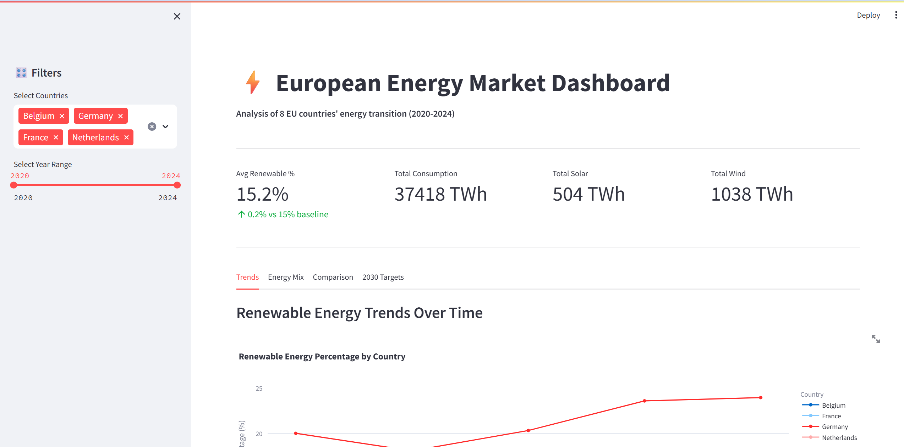
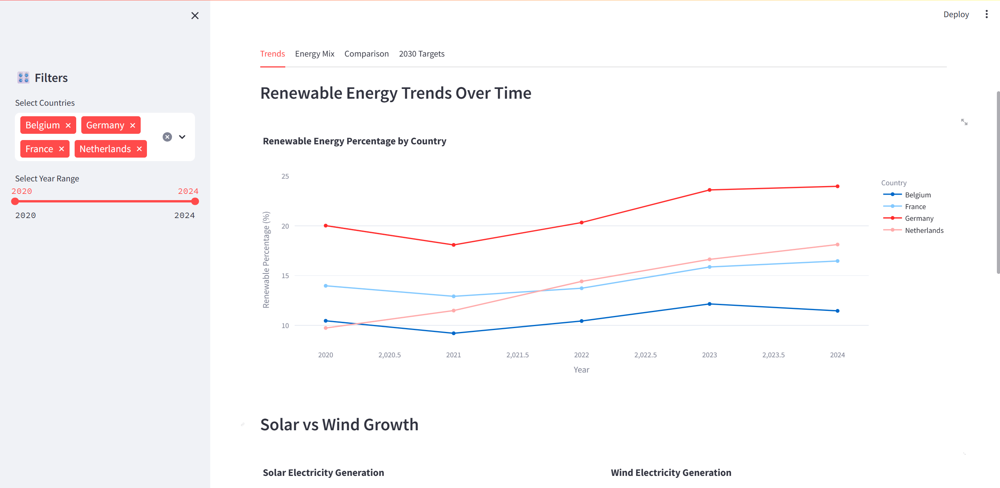
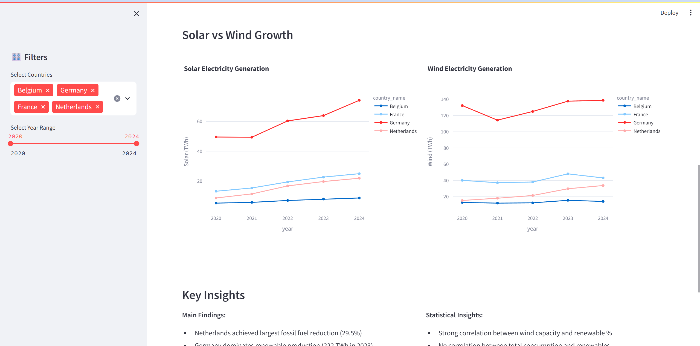
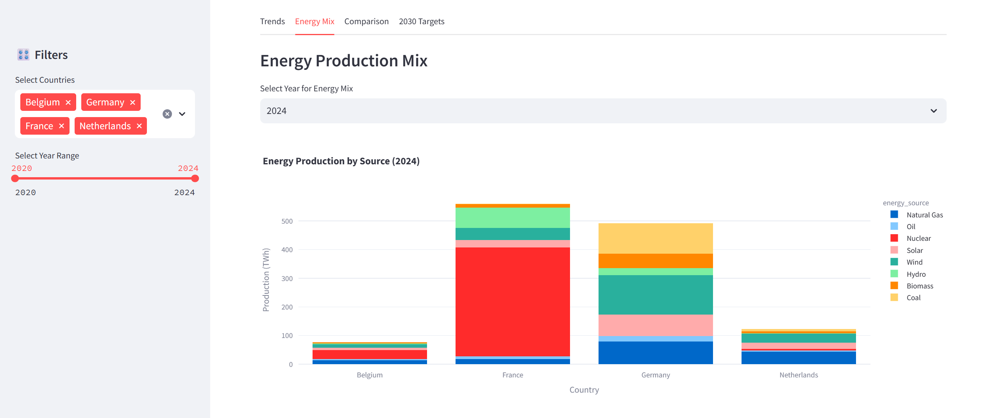
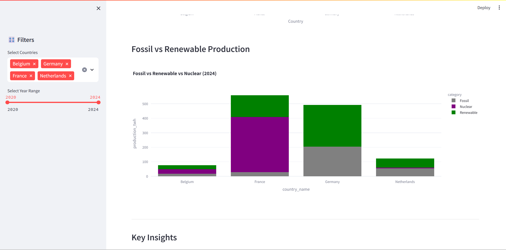
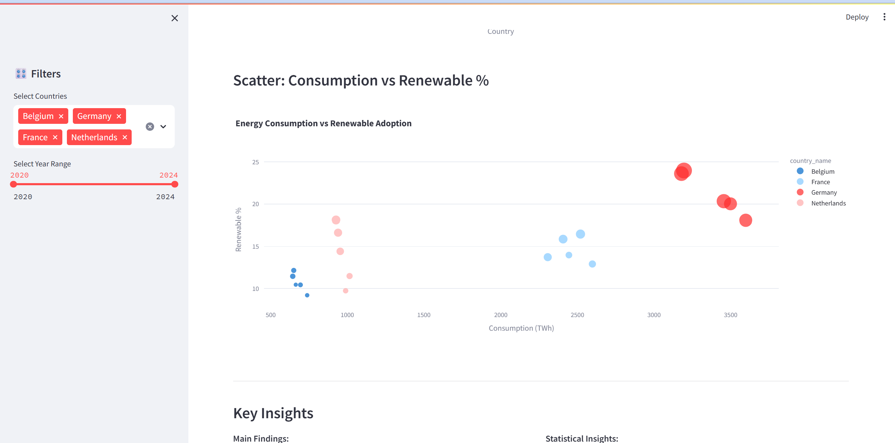
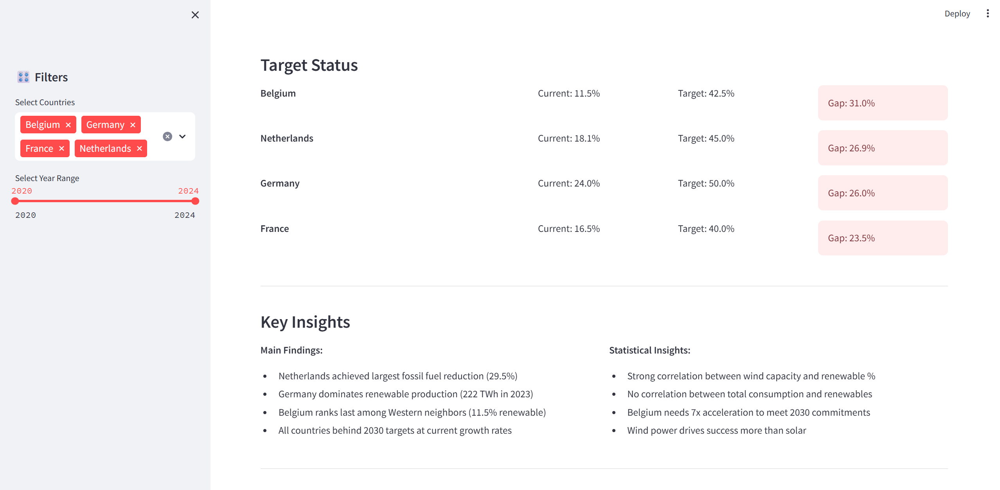
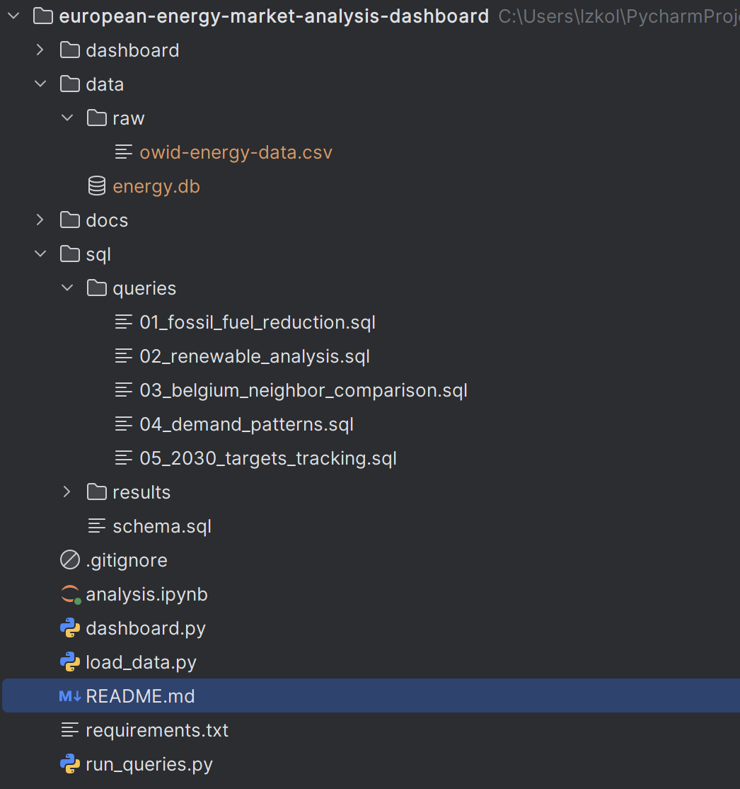

# European Energy Market Analysis Dashboard

> SQL-based analysis of energy production, consumption, and renewable adoption across 8 European countries (2020-2024)

[](https://www.python.org/)
[](https://www.sqlite.org/)
[](https://github.com/owid/energy-data)

## Project Overview

This project analyzes European energy markets to identify trends in renewable adoption, fossil fuel reduction, and progress toward 2030 climate targets. Built as a portfolio demonstration of SQL, data analysis, and business insight generation skills.

**Key Finding**: No European country is currently on track to meet 2030 renewable energy targets at current growth rates. Belgium would need to accelerate renewable growth by 7x to meet commitments.

## Dashboard overview:








## Structure:


## Key Insights

### 1. Netherlands Leading Fossil Fuel Reduction
- 29.5% reduction in fossil fuel dependency (2020-2023)
- Largest decrease among Western European countries

### 2. Germany Dominates Renewable Production
- 222.6 TWh renewable electricity (2023)
- 3x more than any neighboring country

### 3. All Countries Behind 2030 Targets
- Belgium: Current 11.5%, Target 42.5% → Projected to reach only 7.3%
- Germany: Current 24.0%, Target 50.0% → Projected to reach only 26.2%

### 4. Belgium Renewable Opportunity
- Lowest renewable % among Western European neighbors
- 3rd place in per-capita renewable capacity (out of 4)
- Significant growth potential in solar and wind

[Full analysis with business implications →](docs/KEY_INSIGHTS.md)

## Database Structure

```
Countries (8)
├── BEL (Belgium)
├── FRA (France)  
├── NLD (Netherlands)
├── DEU (Germany)
└── ... 4 more

Energy Production (299 records)
├── By source: Solar, Wind, Hydro, Nuclear, Coal, Gas, Oil
└── 2020-2024 data

Renewable Energy (40 records)
├── Renewable percentage
└── Solar/Wind/Hydro electricity generation

Energy Consumption (40 records)
└── Total consumption by country/year
```

## SQL Queries

### 1. Fossil Fuel Reduction Analysis
Identifies which countries reduced fossil fuel dependency most since 2020.

**Key Technique**: CTEs, aggregation, percentage calculations

```sql
WITH fossil_2020 AS (...)
SELECT country_name, 
       fossil_pct_2020, 
       fossil_pct_2023,
       (fossil_pct_2020 - fossil_pct_2023) as reduction
FROM fossil_2020 JOIN fossil_2023
ORDER BY reduction DESC;
```

**Result**: Netherlands (-29.5%), Belgium (-23.2%), Poland (-11.3%)

### 2. Renewable Energy Trends
Analyzes renewable energy adoption and electricity generation over time.

**Key Technique**: JOINs, time series analysis

**Result**: Germany dominates absolute production (222 TWh), Netherlands leads per capita (2.8 TWh/M)

### 3. Belgium vs Neighbors Comparison  
Compares Belgium to France, Netherlands, Germany on renewable metrics.

**Key Technique**: Window functions (RANK), per-capita calculations

**Result**: Belgium ranks 3rd of 4 in renewable capacity per capita

### 4. Energy Demand Patterns
Tracks consumption trends and year-over-year growth.

**Key Technique**: Window functions (LAG), growth rate calculations

**Result**: 2022-2024 shows declining consumption across most countries (-1% to -8%)

### 5. 2030 Climate Targets Tracking
Projects whether countries will meet renewable energy targets.

**Key Technique**: Multiple CTEs, growth projections, conditional logic

**Result**: All 8 countries currently behind targets, requiring 2-5x acceleration

## Technical Stack

- **Database**: SQLite
- **Language**: Python 3.9+
- **Libraries**: pandas, sqlite3
- **Data Source**: Our World in Data (OWID)
- **Analysis**: 5 complex SQL queries with CTEs, window functions, aggregations

## Getting Started

### Prerequisites
- Python 3.9+
- SQLite3

### Installation

```bash
# Clone repository
git clone https://github.com/lizakolosova/european-energy-market-analysis-dashboard.git
cd european-energy-analysis

# Create virtual environment
python -m venv venv
source venv/bin/activate

# Install dependencies
pip install -r requirements.txt

# Load data
python load_data.py
```

### Run Analysis

```bash
# Run all queries
python run_queries.py
```

## Skills Demonstrated

- SQL query writing (CTEs, JOINs, window functions, aggregations)
- Database design and normalization
- ETL pipeline development (Python + pandas)
- Business insight generation from data
- Data visualization and reporting
- Working with real-world datasets (OWID)

## Use Cases

This analysis is relevant for:
- **Energy Policy Analysts**: Track renewable adoption progress
- **Investment Firms**: Identify renewable growth opportunities
- **Consulting**: Benchmark country performance
- **Government**: Assess policy effectiveness

## Data Source

Data sourced from [Our World in Data - Energy Dataset](https://github.com/owid/energy-data), which aggregates:
- Energy Institute Statistical Review
- Ember Yearly Electricity Data
- Eurostat
  (download the owid-energy-data.csv and put it in data/raw/ folder before running the project.)

**Coverage**: 8 EU countries, 2020-2024, 40 data points, 299 production records

## Future Enhancements

- [ ] Add electricity price analysis (Eurostat API)
- [ ] Include seasonal patterns (monthly data)
- [ ] Add machine learning forecasting (Prophet/ARIMA)
- [ ] Expand to all 27 EU countries
- [ ] Include energy storage capacity data